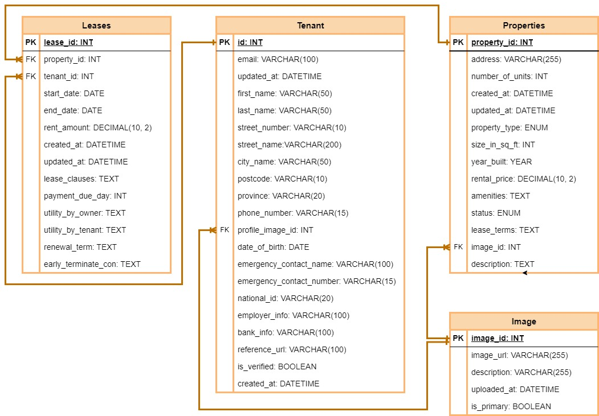
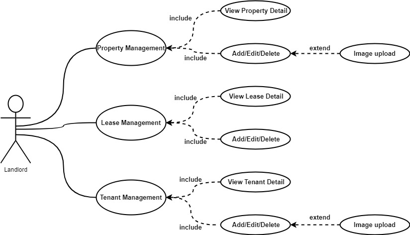
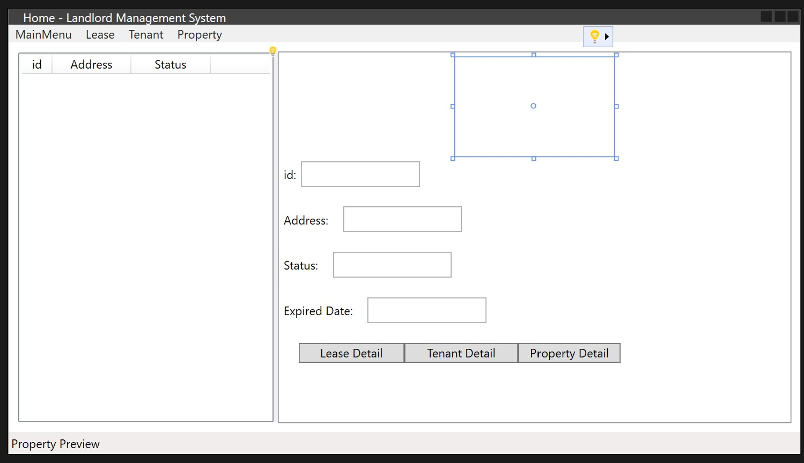
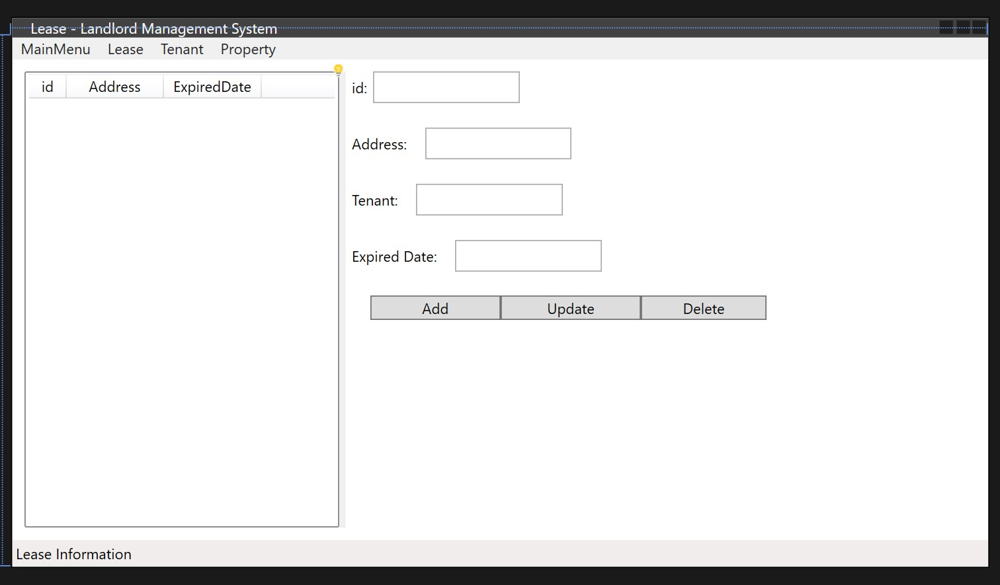
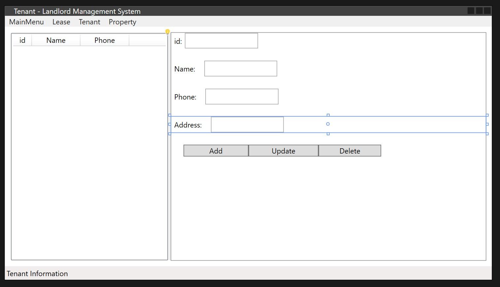
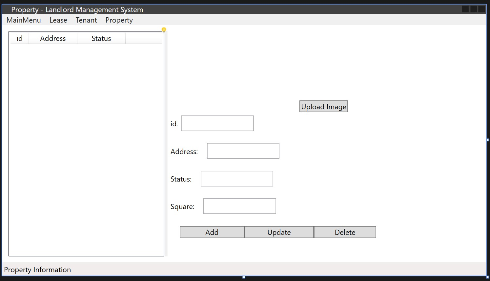
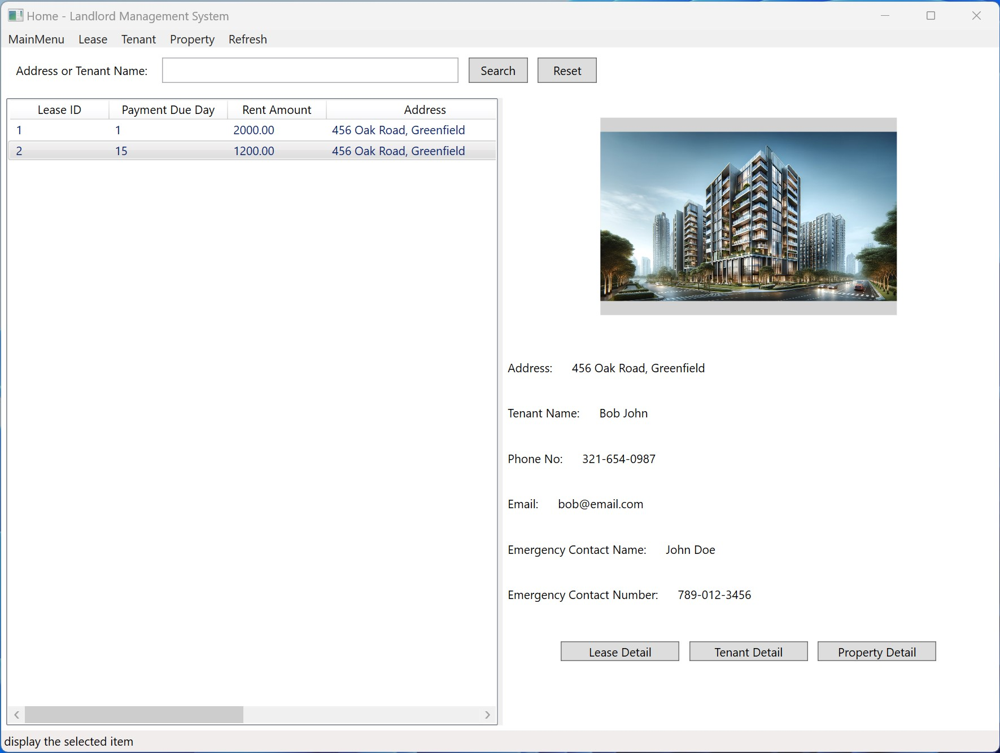
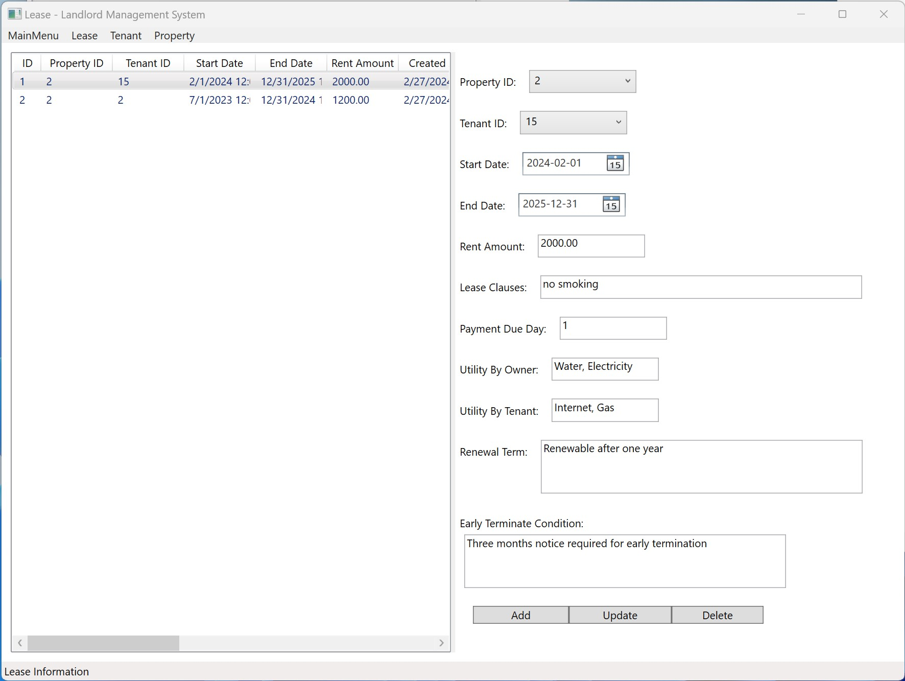
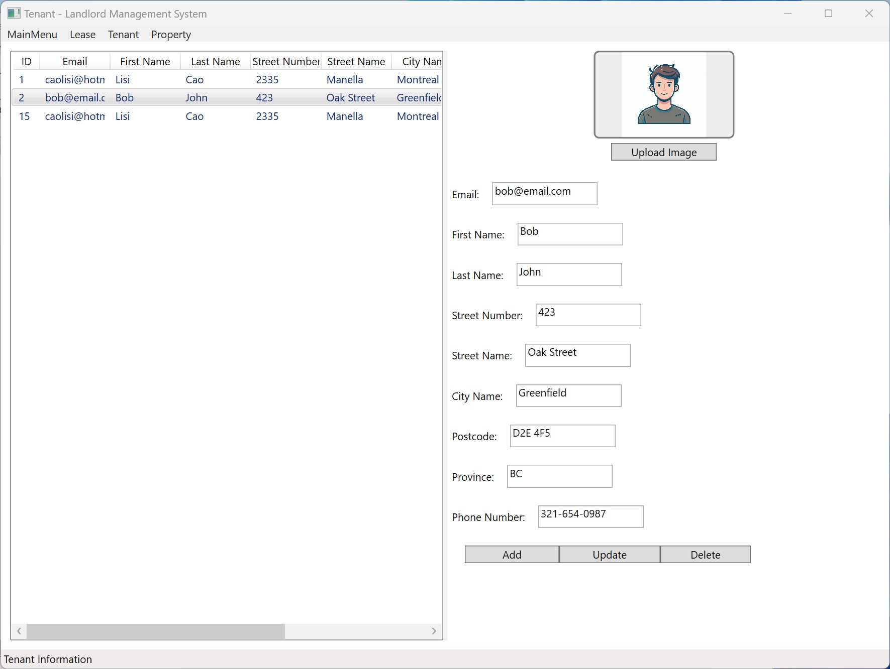
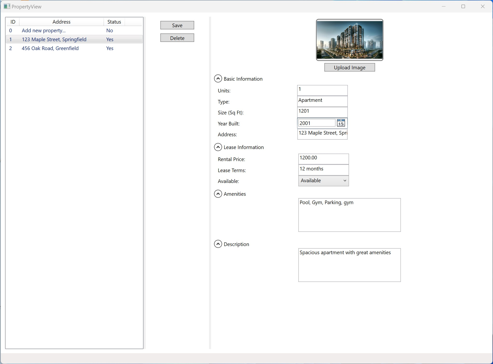

# Project Proposal

## Landlord Management System

### Team members:

-   Lisi Cao
-   Shixin Tang
-   Zhi Li

### Project Description:

The Landlord Management System (LLMS) is a comprehensive desktop application designed to streamline and automate the management of rental properties for landlords. The core objective of LLMS is to provide an intuitive and user-friendly platform for landlords to manage their properties, leases, tenants, and related financial transactions efficiently. LLMS aims to reduce administrative overhead, improve accuracy in record-keeping, and enhance tenant satisfaction.

The system features a modular design, comprising four main components: property management, lease management, tenant management, and property list. Each module is accessible via a user-friendly interface, enabling landlords to perform a wide range of operations, from tracking property status and lease agreements to managing tenant information.

### Bullet-point List of:

#### Technologies Used:

-   WPF, .NET Framework, C#, Azure SQL Database, Azure Blob Storage, Entity Framework, LINQ.

#### Special Features:

-   Interactive property listing with detailed views.
-   Lease and tenant management.
-   Automated reminders for lease renewals and payment due dates.

#### Challenges:

-   Integration of Azure SQL Database access
-   Integration of Azure Storage to save images.

### Database Design:

The database design is structured to support the system's core functionalities effectively:

### Use Case Diagram:

### Mockups:

#### Main Window:

Provides quick access to all windows. Show the property list of the landlord. And support buttons to guide users to see the details of the current property, lease, and tenant.

#### Lease Window:

Show the lease list and detail information, and allow the user to create, update, or delete one lease.

#### Tenant Window:

Show the tenant list and detail information, and allow the user to create, update, or delete one tenant.

#### Property Window:

Show the property list and detail information including one image, and allow the user to create, update, or delete one property.

## Final application Snapshots
### These are the snapshots of the final application.

### Main Window

### Lease Window

### Tenant Window

### Property Window

